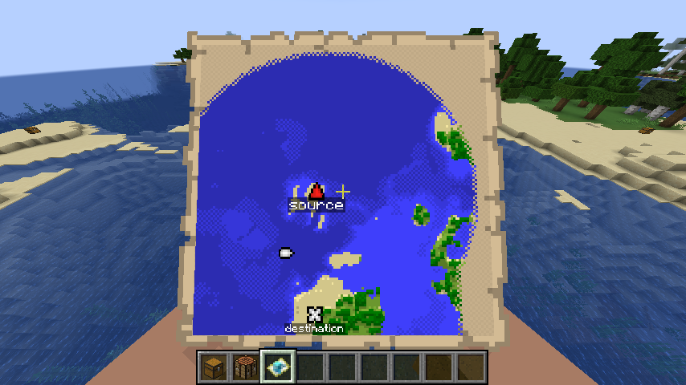
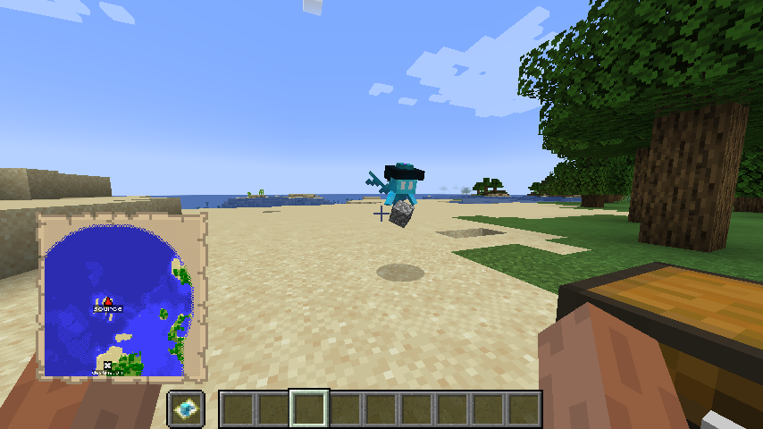

# Repurposed Livings

Giving a new purpose to entities (currently only the Allay). A ForgeJam 2022 entry.

## Feature Overview

- adds a new item, the Mind Control Device - when attached to an Allay this handy helmet will take over the Allay's
  brain and make it very submissive to your wishes
- adds a new map-like item, the Allay Map - with this map you can precisely configure a source and a delivery target
  chest, once that is done you can give the map to an Allay under your control and it will happily start fullfilling its
  new purpose, that is **item transportation**
  - the map supports in hand rendering as well as map duplication and map expansion (both the same recipe as for Vanilla
    maps)
  - the Allay Map does currently not support rendering in an item frame and provides currently no integration with
    Vanilla's cartography table
- adds a small upgrade system which allows you to equip your new little voluntary friends with some belt-chests for
  extra storage capacity and new wings, for an even faster item transfer

## Obtaining the Items

The Mind Control Device as well as its Echo variant can both be crafted normally in the crafting station. Same for the
chest and speed upgrade. You can also find them in the "Repurposed Livings" creative tab.

To get hold of an Allay Map you have to Shift-Right click any chest with an empty (Vanilla) map. The location of this
chest will be set as the item source. You can then proceed to Shift-Right click another chest to set up the delivery
target. When finished, you can give the map to a controlled Allay.
Note that all this works with the map in the off-hand as well (as long as there is no other item in the main hand).

## Controlling Allays

Allays are very smart little creatures, if you try to take control over them as is, they will block you off. But Allays
are not only smart, they are also very much in love with dancing - they cannot help but vibing to that sick music. So
maybe try overtaking them when they are fully occupied by the music and don't pay any attention to their surroundings?

Alternatively you could also use the newer and better version of the Mind Control Device, the Echo variant. With the
power of the echo shard, this device is so persuading that no Allay can resist it.

## Images

  
   <small>Taking control over an Allay</small>   

  
   <small>Allay Map in-hand rendering</small>   

  
   <small>An controlled Allay goes about its duties</small>

### Credits

- Mind Control Device Sound - [Magical focus energy](https://freesound.org/people/Iridiuss/sounds/519415)
  by Iridiuss
